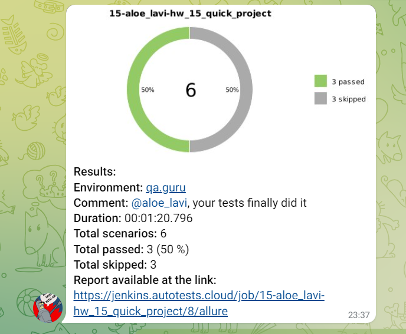

# Проект по автоматизации тестирования веб-приложения МойСклад

## :page_with_curl:	Содержание

## :rocket: Технологии и инструменты

## 	Запуск тестов из терминала

### Локальный запуск тестов

### Удаленный запуск тестов

### Параметры сборки

## Allure отчет

### Главная страница Allure-отчета

### Страница отдельного теста

## Уведомления в Telegram с использованием бота

## Пример видео выполнения теста в Selenoid
